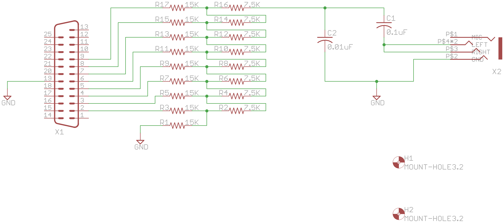

# pcb-covox
A tiny sound card based on the Covox Speech Thing design

##PCB Design software and addons used

1. Eagle 7.5.0: I use Standard but Light should still be able to open/modify the files.

##Images
None at this time

##Schematic drawings
Images are exported from Eagle at 600dpi.

##Parts required
Use Libreoffice to open [pcb-covox-bom.ods](pcb-covox-bom.ods)

##References
1. [Hardware implementation references](https://blog.frantovo.cz/c/307/DAC%20%28zvukov%C3%A1%20karta%29%20pro%20LPT%20port%20a.k.a.%20Covox)
2. [Design reference](http://kb.gr8bit.ru/KB0010/GR8BIT-KB0010-Adding-multimedia-capability-covox-device.html)
3. [MJ-2135 package obtained from coqui-dip](https://github.com/open-eie/coqui-dip)
